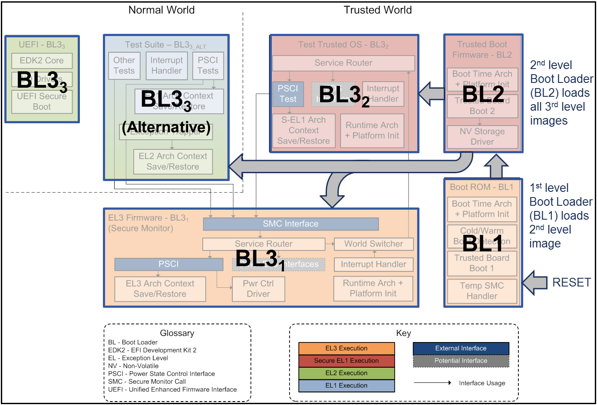

# Bootloader Files

These files are required to boot the ODROID, which makes use of ARM TrustZone.

These files are signed by ODROID and Samsung, so it is unlikely they will ever be updated.

## Boot Sequence

There are four binary blobs for booting:

- `E4412_S.bl1.HardKernel.bin` - Bootloader stage 1
- `bl2.signed.bin` - Bootloader stage 2
- `E4412_S.tzsw.signed.bin` - TrustZone SoftWare (TZSW)
- `u-boot.bin` - Signed U-Boot Binary

The binary blobs are "fused" into the SD card at the right positions using `sd_fusing.sh`.

